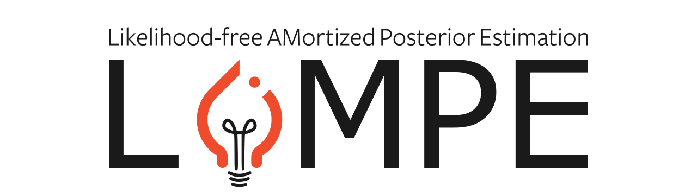

.. image:: static/banner_dark.svg
   :class: only-dark

LAMPE
=====

:mod:`lampe` is a simulation-based inference (SBI) package that focuses on amortized estimation of posterior distributions, without relying on explicit likelihood functions; hence the name *Likelihood-free AMortized Posterior Estimation* (LAMPE). The package provides `PyTorch <https://pytorch.org>`_ implementations of modern amortized simulation-based inference algorithms like neural ratio estimation (NRE), neural posterior estimation (NPE) and more. Similar to PyTorch, the philosophy of LAMPE is to avoid obfuscation and expose all components, from network architecture to optimizer, to the user such that they are free to modify or replace anything they like.

Installation
------------

The :mod:`lampe` package is available on `PyPI <https://pypi.org/project/lampe>`_, which means it is installable via `pip`.

.. code-block:: console

    pip install lampe

Alternatively, if you need the latest features, you can install it from the repository.

.. code-block:: console

    pip install git+https://github.com/francois-rozet/lampe

Simulation-based inference
--------------------------

In many areas of science, computer simulators are used to describe complex phenomena such as high energy particle interactions, gravitational waves or neuronal ion-channel dynamics. These simulators are stochastic models/programs that generate synthetic observations according to input parameters. A common task for scientists is to use such models to perform statistical inference of the parameters given one or more observations. Unfortunately, simulators often feature high-dimensional parameter spaces and intractable likelihoods, making inference challenging.

Formally, a stochastic model takes (a vector of) parameters :math:`\theta \in \Theta` as input, samples internally a series :math:`z \in \mathcal{Z}` of latent variables and, finally, produces an observation :math:`x \in \mathcal{X} \sim p(x | \theta, z)` as output, thereby defining an implicit likelihood :math:`p(x | \theta)`. This likelihood is typically *intractable* as it corresponds to the integral of the joint likelihood :math:`p(x, z | \theta)` over *all* possible trajectories through the latent space :math:`\mathcal{Z}`. Moreover, in Bayesian inference, we are interested in the posterior

.. math:: p(\theta | x)
    = \frac{p(x | \theta) p(\theta)}{p(x)}
    = \frac{p(x | \theta) p(\theta)}{\int_\Theta p(x | \theta') p(\theta') \operatorname{d}\!\theta'}

for some observation :math:`x` and a prior distribution :math:`p(\theta)`, which not only involves the intractable likelihood :math:`p(x | \theta)` but also an intractable integral over the parameter space :math:`\Theta`. The omnipresence of this problem gave rise to a rapidly expanding field of research referred to as simulation-based inference (SBI).

References
----------

The frontier of simulation-based inference
(Cranmer et al., 2020)
https://www.pnas.org/doi/10.1073/pnas.1912789117

Approximating Likelihood Ratios with Calibrated Discriminative Classifiers
(Cranmer et al., 2015)
https://arxiv.org/abs/1506.02169

Likelihood-free MCMC with Amortized Approximate Ratio Estimators
(Hermans et al., 2019)
https://arxiv.org/abs/1903.04057

Fast Likelihood-free Inference with Autoregressive Flows
(Papamakarios et al., 2018)
https://arxiv.org/abs/1805.07226

Automatic Posterior Transformation for Likelihood-Free Inference
(Greenberg et al., 2019)
https://arxiv.org/abs/1905.07488

Arbitrary Marginal Neural Ratio Estimation for Simulation-based Inference
(Rozet et al., 2021)
https://arxiv.org/abs/2110.00449

.. toctree::
    :caption: lampe
    :hidden:
    :maxdepth: 2

    tutorials.rst
    api/index.rst

.. toctree::
    :caption: Development
    :hidden:
    :maxdepth: 1

    Contributing <https://github.com/francois-rozet/lampe/blob/master/CONTRIBUTING.md>
    Changelog <https://github.com/francois-rozet/lampe/releases>
    License <https://github.com/francois-rozet/lampe/blob/master/LICENSE>
